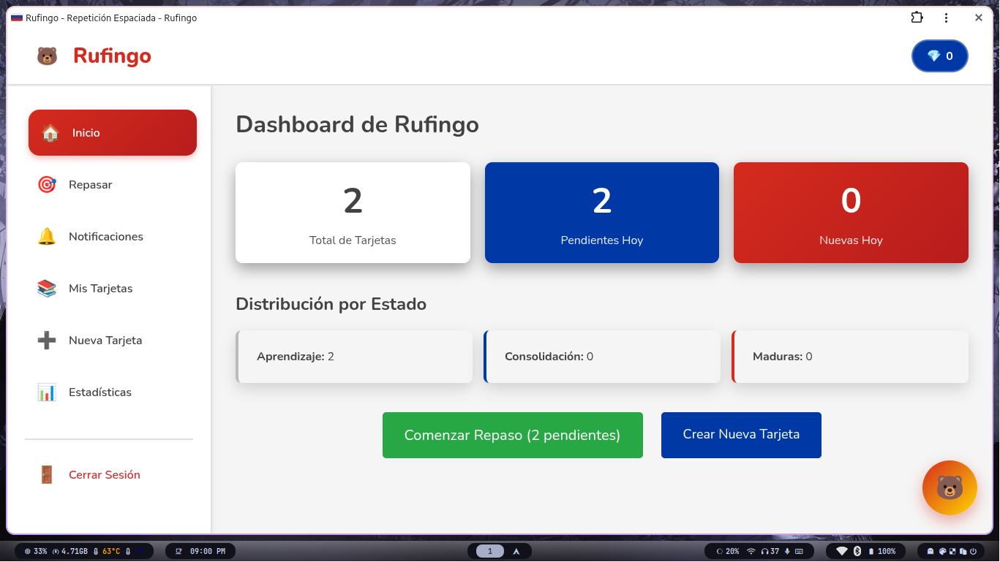

### Rulingo 🐻

### Mi problema

El algoritmo SM-2 está optimizado para la retención a largo plazo, pero no considera explícitamente la adquisición inicial de información. Las aplicaciones modernas combinan varias fases de repetición.
Para resolver el problema de la memorización inicial (a corto plazo) antes de pasar al espaciado a largo plazo, se propone un sistema de tres fases (o “cubos”).

**Estrategia de Tres Fases para Adquisición y Consolidación**

---

### Fase 1: Aprendizaje Intensivo (Corto Plazo / Inmediato)

El objetivo es la adquicisión rápida  de nueva información y familiaridad con el material.

**Registro inicial:** Cuando el usuario ve una nueva pregunta por primera vez.  

**Regla:** Aplica la repetición intensiva. Se repite la pregunta con alta frecuencia en la misma sesión o en sesiones muy próximas.  

**Métrica:** Conteo de aciertos consecutivos y tiempo de respuesta.  

**Si falla:** La tarjeta se mantiene en este cubo de “Aprendizaje”.  

**Umbral de promoción:** La tarjeta pasa a la siguiente fase cuando se cumplen estas condiciones:  

1. Ha sido respondida correctamente tres veces consecutivas.
2. Cada respuesta ha ocurrido con al menos 20 a 30 segundos de separación.
3. El tiempo promedio de respuesta es bajo (por ejemplo, menor a 4 segundos).

**Límite diario:** Para evitar saturación, se recomienda un máximo de 15 nuevas tarjetas por día.

**Sistema de repetición intensiva - Intervalos:**

* 5 segundos
* 25 segundos
* 2 minutos
* 10 minutos

**Tarjetas de memoria (Flashcards):**

* Pregunta (frente) y respuesta (reverso).
* Respuesta correcta: avanza al siguiente intervalo.
* Respuesta incorrecta: retrocede al intervalo anterior.

---

### Fase 2: Consolidación (Mediano Plazo / Días)

Una vez que el usuario demostró un conocimiento básico (Fase 1), la tarjeta entra en el sistema de repetición espaciada simplificado para consolidar la memoria.

**Regla:** Se aplica el algoritmo SM-2, pero con intervalos iniciales cortos.  

**Métrica:** Calificación en escala 0–5 ajustada según el tiempo de respuesta.  

**Intervalos iniciales recomendados:**

* Primer repaso: 1 día.
* Segundo repaso: 3 días.
* Tercer repaso: 7 días.
* Cuarto repaso: 14 días.

**Retroceso:** Si el usuario falla en esta fase, la tarjeta regresa a la Fase 1 (Aprendizaje Intensivo). Esto garantiza que se recupere el recuerdo mediante repetición inmediata antes de volver al espaciamiento.

**Umbral de promoción:** La tarjeta pasa a la siguiente fase cuando completa los primeros 3 a 5 intervalos sin fallar.

---

### Fase 3: Mantenimiento (Largo Plazo / Semanas o Meses)

En esta fase se aplica la repetición espaciada pura para evitar el olvido a largo plazo.

**Regla:** Se usa el algoritmo SM-2 completo, ajustando los intervalos y el factor de facilidad (EF) de acuerdo con el rendimiento del usuario y el tiempo de respuesta.
**Intervalos:** Crecen de manera exponencial, por ejemplo: 1 mes, 3 meses, 8 meses, etc.
**Retroceso:** Si el usuario falla en esta fase, la tarjeta retrocede a la Fase 2 (inicio de la consolidación).

---

### Cálculo de la calificación y ajuste por tiempo

Cada respuesta se evalúa con una calificación base entre 0 y 5:

| Calificación | Descripción                     |
| ------------ | ------------------------------- |
| 5            | Perfecto, respuesta inmediata   |
| 4            | Correcta con ligera vacilación  |
| 3            | Correcta con esfuerzo           |
| 2            | Incorrecta, pero algo recordada |
| 1            | Incorrecta, sin recuerdo        |
| 0            | Olvido total                    |

El tiempo de respuesta ajusta automáticamente esta calificación:

| Tiempo de respuesta | Ajuste |
| ------------------- | ------ |
| 0–3 s               | +0     |
| 3–6 s               | −0.5   |
| 6–10 s              | −1     |
| >10 s               | −2     |

Este ajuste permite que el algoritmo valore tanto la precisión como la fluidez del recuerdo. El factor de facilidad (EF) se actualiza con la fórmula del SM-2 usando la calificación ajustada, lo que afecta directamente los intervalos futuros.

---

### Estados de las tarjetas

Cada tarjeta debe mantener su estado en la base de datos:

* Estado =  'Aprendizaje' (Fase 1)
* Estado = 'Consolidación' (Fase 2)
* Estado = 'Maduro' (Fase 3)

De esta manera, el sistema sabe cuándo aplicar repeticiones intensivas, espaciadas o de mantenimiento.

---

Al estructurar el sistema de esta manera se garantiza que el usuario adquiera el conocimiento mediante repetición intensiva a corto plazo (Fase 1), lo consolide con espaciado controlado (Fase 2) y finalmente lo mantenga mediante espaciado optimizado a largo plazo (Fase 3).

---

La aplicación es completamente online, desarrollada con Django como backend y una base de datos SQLite3 para almacenar el progreso y las configuraciones del usuario. El frontend se implementa únicamente con HTML, CSS y JavaScript, manteniendo la lógica principal en el servidor.

El sistema cuenta con notificaciones push integradas mediante un Service Worker y el uso de la API Web Push. De esta forma, la aplicación podrá enviar notificaciones incluso cuando el navegador se encuentre cerrado, permitiendo al usuario recibir alertas sobre tarjetas pendientes directamente en su dispositivo Android.

La aplicación funciona como una PWA (Progressive Web App), lo que permite su instalación en el dispositivo sin necesidad de una app nativa. PythonAnywhere se utilizará como entorno de despliegue y para la ejecución de tareas programadas que verifiquen periódicamente si existen tarjetas disponibles para repaso, enviando las notificaciones correspondientes a los usuarios suscritos.
